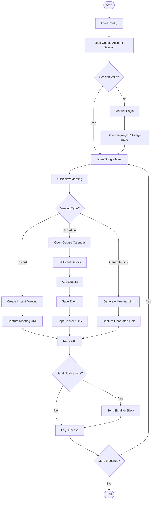

# 1. Updating Emails on Private Youtube Videos

```mermaid
flowchart TD

%% ==========================
%% Initialization
%% ==========================

A([Start]) --> B[Load Configuration]
B --> C[Read Environment Variables]
C --> D[Load storage_state.json]
D --> E{Session Exists?}

E -- No --> F[Launch Chromium]
F --> G[Open Google Login]
G --> H[Manual Authentication]
H --> I[Save storage_state.json]
I --> J[Close Browser]

E -- Yes --> K[Launch Chromium with Saved Session]
J --> K

%% ==========================
%% Open Google Meet
%% ==========================

K --> L[Create Browser Context]
L --> M[Create New Page]
M --> N[Navigate to meet.google.com]
N --> O[Wait Until Network Idle]

O --> P{Page Loaded Successfully?}

P -- No --> Q[Retry Navigation]
Q --> N

P -- Yes --> R[Locate New Meeting Button]
R --> S[Click New Meeting]

%% ==========================
%% Select Meeting Type
%% ==========================

S --> T{Meeting Type}

T -->|Create Instant Meeting| U[Start Instant Meeting]

T -->|Create Meeting For Later| V[Generate Meeting Link]

T -->|Schedule in Google Calendar| W[Open Google Calendar]

%% ==========================
%% Instant Meeting Flow
%% ==========================

U --> U1[Wait for Meeting Room]
U1 --> U2[Dismiss Popups]
U2 --> U3[Copy Meeting URL]
U3 --> U4[Read Meeting Code]
U4 --> Z

%% ==========================
%% Generate Link Flow
%% ==========================

V --> V1[Wait for Link Dialog]
V1 --> V2[Copy Generated Link]
V2 --> V3[Extract Meeting Code]
V3 --> Z

%% ==========================
%% Calendar Flow
%% ==========================

W --> W1[Create Calendar Event]
W1 --> W2[Enter Event Title]
W2 --> W3[Select Date]
W3 --> W4[Select Start Time]
W4 --> W5[Select End Time]
W5 --> W6[Add Guests]
W6 --> W7[Generate Google Meet Link]
W7 --> W8[Save Calendar Event]
W8 --> W9[Read Generated Meet URL]
W9 --> Z

%% ==========================
%% Store Output
%% ==========================

Z[Meeting Information Available]
Z --> AA[Store Meeting URL]
AA --> AB[Store Meeting Code]
AB --> AC[Save to CSV or Database]

%% ==========================
%% Optional Notifications
%% ==========================

AC --> AD{Send Notifications?}

AD -->|Yes| AE[Generate Email Message]
AE --> AF[Send Email]

AF --> AG[Send Slack or Teams Notification]

AD -->|No| AH[Skip Notifications]

AG --> AI
AH --> AI

%% ==========================
%% Loop
%% ==========================

AI{Create Another Meeting?}

AI -->|Yes| N

AI -->|No| AJ[Close Browser]
AJ --> AK([End])
```

# 2. Creating own Google Meet: 

```mermaid
flowchart TD

    A([Start]) --> B[Load Config]
    B --> C[Load Google Account Session]
    C --> D{Session Valid?}

    D -- Yes --> G[Open Google Meet]
    D -- No --> E[Manual Login]
    E --> F[Save Playwright Storage State]
    F --> G

    G --> H[Click New Meeting]
    H --> I{Meeting Type?}

    I -->|Instant| J[Create Instant Meeting]
    I -->|Schedule| K[Open Google Calendar]
    I -->|Generate Link| L[Generate Meeting Link]

    J --> M[Capture Meeting URL]

    K --> N[Fill Event Details]
    N --> O[Add Guests]
    O --> P[Save Event]
    P --> Q[Capture Meet Link]

    L --> R[Capture Generated Link]

    M --> S[Store Link]
    Q --> S
    R --> S

    S --> T{Send Notifications?}

    T -->|Yes| U[Send Email or Slack]
    T -->|No| V[Log Success]

    U --> V
    V --> W{More Meetings?}

    W -->|Yes| G
    W -->|No| X([End])
```
