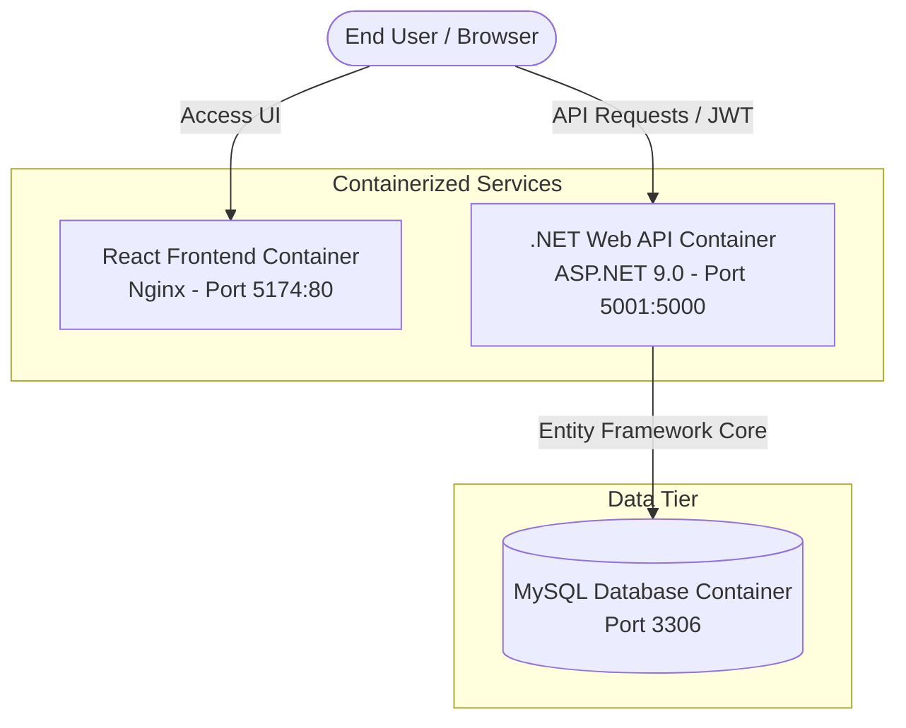

# Veriton LMS - Learning Experience Platform (LXP)

Welcome to the **Veriton LMS/LXP** codebase repository. This project is a modern, containerized Learning Management System built using a decoupled architecture, with a robust **.NET 9 Web API** backend and a responsive **React (Vite) + Tailwind CSS** frontend.

---

## 🏗️ System Architecture



---

## 📂 Project Structure

```text
lxp-numeera.com/
├── Backend/                 # C# Solution and Project Source Code
│   ├── Veriton-ms.slnx      # .NET XML-based Solution Map
│   ├── Veriton.API/         # ASP.NET Core Web API Controllers & Config
│   ├── Veriton.Application/ # Business Logic, Services, and DTOs
│   ├── Veriton.Domain/      # Domain Models & Core System Entities
│   └── Veriton.Infrastructure/ # Database Context, JWT Auth, and Providers
├── Frontend/                # React App Source Code
│   ├── src/                 # Modules (academics, dashboard, eventsHub, etc.)
│   ├── index.html           # SPA entry point
│   ├── tailwind.config.js   # Style configurations (Tailwind CSS v4)
│   └── Dockerfile           # Multi-stage production build (Node -> Nginx)
├── docker-compose.yml       # Production Orchestration file
└── RBAC_Audit.md            # Role-Based Access Control Audit & Policies
```

---

## 🔒 Role-Based Access Control (RBAC)

The system maps backend roles to frontend user types (`utype`) to control UI visibility and API route access.

| Backend Role | Frontend `utype` | Description & Allowed Actions |
| :--- | :--- | :--- |
| `Staff` | `staff` | **Platform Management:** Curriculum oversight (tracks, modules, lessons), user provisioning (managing staff, trainers, and learners), and general administration. |
| `Trainer` | `trainer` | **Content & Instruction:** Managing curriculum tracks, modules, lessons, and tracking learners' progress. |
| `Learner` | `learner` | **Learning Hub:** Consuming course tracks, reading/completing lessons, and personal progress tracking. |

---

## 🛠️ Environment Variables Configuration

To run the application, copy `.env.example` to `.env` in the root folder and configure the following variables:

```bash
cp .env.example .env
```

### 1. Database Configuration
* `MYSQL_ROOT_PASSWORD`: The root password for the MySQL database.
* `MYSQL_DATABASE`: The name of the LMS database schema (default: `veriton_db`).
* `MYSQL_USER` / `MYSQL_PASSWORD`: Non-root credentials for database access.

### 2. Backend & Security Configuration
* `JWT_KEY`: The signing key for JSON Web Tokens (must be a long random string, minimum 32 characters).
* `JWT_ISSUER` / `JWT_AUDIENCE`: Token metadata configurations (default: `Veriton` / `VeritonUsers`).
* `ALLOWED_ORIGINS`: Comma-separated CORS policy origins (e.g. `http://localhost:5173`).

### 3. Identity Provider (Social Login)
* Google, GitHub, and LinkedIn OAuth Client IDs and Secrets.

---

## 🚀 Getting Started

### Option A: Local Development

> [!NOTE]
> Make sure you have **.NET 9.0 SDK**, **Node.js 20+**, and a running **MySQL** server locally.

#### 1. Backend API
1. Navigate to the backend directory:
   ```bash
   cd Backend
   ```
2. Restore packages and run the project:
   ```bash
   dotnet restore
   dotnet run --project Veriton.API/Veriton.API.csproj
   ```
3. Open Swagger UI at `http://localhost:5000/swagger`.

#### 2. Frontend React Client
1. Navigate to the frontend directory:
   ```bash
   cd Frontend
   ```
2. Install dependencies:
   ```bash
   npm install
   ```
3. Run the development server:
   ```bash
   npm run dev
   ```
4. Access the web app at `http://localhost:5173`.

---

### Option B: Production Deployment via Docker Compose

> [!IMPORTANT]
> Ensure Docker and Docker Compose are installed on your host system.

1. Build and boot up all services (Backend, Frontend, and Networking) in detached mode:
   ```bash
   docker compose up -d --build
   ```
2. Verify that all containers are healthy:
   ```bash
   docker compose ps
   ```
3. The services will be exposed at:
   * **Frontend UI**: `http://localhost:5174` (or your production domain)
   * **Backend API**: `http://localhost:5001`

---

## 📈 Troubleshooting & Commands

* **View Logs**:
  ```bash
  docker compose logs -f
  ```
* **Stop Services**:
  ```bash
  docker compose down
  ```
* **Verify Production Build Compiles (TypeScript)**:
  ```bash
  cd Frontend && npm run build
  ```
